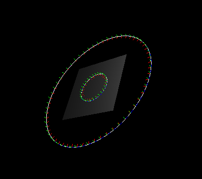

# <center>Project1 实验报告
#### <center> 组员：邹怡 21307130422、吴皓玥 21307110386
---
## 一.曲线的绘制
### 1. 三次贝塞尔曲线
#### 实验要求：
主要要求完成`curve.cpp`中的`evalBezier`函数，需要求出曲线中每个点的坐标，以及对应点的法向量N、切向量T和次法线向量B
#### 实验原理：
- 对于三次贝塞尔曲线，需要对给出的四个点和steps，曲线可以由四个点和一个与t有关的函数加权相乘并相加求得，三次贝塞尔曲线公式如下：
$P(t)=P_0(1-t)^3+3P_1t(1-t)^2+3P_2t^2(1-t)+P_3t^3$，其中t∈[0,1],t的增量$δ=\frac{1.0}{steps}$.
- 对于每个点的局部坐标系，可以由$P(t)$函数生成，具体公式如下：
$T_i=P'(t_i).normalized()$
$N_i=(B_{i-1}*T_i).normalize()$
$B_i=(T_i*N_i).normalize()$
但是对于第一个点的$B_0$需要进行特殊初始化，可以选择(0,0,1)进行初始化
- 对于上面公式，可展开变换，并通过矩阵相乘方便代码编写，具体公式如下：

#### 代码解读
- 在具体的函数中，传入一个点集和一个unsigned参数steps作为每一组(4个点)所需要计算的次数。将点集分为P_size/3组，因为点集由3n+1个点组成，故可以分成每组4个组间收尾相连的segments个组
- 每一组点的计算中，t从0开始，每次增加$δ=\frac{1.0}{steps}$，计算出每个点的坐标，并根据公式计算出局部坐标系B,T,N。直接调用矩阵的对应函数和矩阵乘法，<strong>注意向量不能直接进行相乘，而是要调用Vector3f的对应cross函数</strong>
- 对于第一个点进行初始化处理，第一个点为P1，切向量T为t=0代入P’(t)，得到3*(P2-P1),B0取(0,0,1)，后续循环每一段计算steps个点即可。
- 使用curves对CurvePoint进行存储，在计算出每个CurvePoint的对应信息后将其push进curves最后返回
```
Curve evalBezier(const vector< Vector3f >& P, unsigned steps)
{
	// Check
	if (P.size() < 4 || P.size() % 3 != 1)
	{
		cerr << "evalBezier must be called with 3n+1 control points." << endl;
		exit(0);
	}

	int P_size = P.size();
	int segments = P_size/3;
	float t,delta;
	delta = 1.0/steps;
	t = 0;
	Curve curves;
	Matrix4f M_bez={1,-3,3,-1,
					0,3,-6,3,
					0,0,3,-3,
					0,0,0,1};
	Vector3f B0={0,0,1};
	Vector4f MT;
	Vector4f MT_dao;
	
	for(int i=0;i<segments;i++)
	{
		t = 0;
		Vector3f P1,P2,P3,P4;
		P1 = P[i*3];
		P2 = P[i*3+1];
		P3 = P[i*3+2];
		P4 = P[i*3+3];
		
		if(i == 0)
		{
			CurvePoint C;
			C.V = P1;
			C.T =(3* (P2-P1)).normalized();
			C.N = Vector3f::cross(B0,C.T).normalized();
			C.B = Vector3f::cross(C.T,C.N).normalized();
			curves.push_back(C);
		}
		for(unsigned j=0;j<steps;j++)
		{
			t+=delta;
			CurvePoint NewC;
			Vector4f T(1,t,t*t,t*t*t);
			Vector4f T_dao(0,1,2*t,3*t*t);
			MT=M_bez*T;
			MT_dao=M_bez*T_dao;
			NewC.V = P1*MT.x()+P2*MT.y()+P3*MT.z()+P4*MT.w();
			NewC.T = (P1*MT_dao.x()+P2*MT_dao.y()+P3*MT_dao.z()+P4*MT_dao.w()).normalized();
			NewC.N = Vector3f::cross(curves.back().B,NewC.T).normalized();
			NewC.B = Vector3f::cross(NewC.T,NewC.N).normalized();
			curves.push_back(NewC);
		}
	}

	cerr << "\t>>> evalBezier has been called with the following input:" << endl;

	cerr << "\t>>> Control points (type vector< Vector3f >): " << endl;
	for (int i = 0; i < (int)P.size(); ++i)
	{
		cerr << "\t>>> " << P[i] << endl;
	}

	cerr << "\t>>> Steps (type steps): " << steps << endl;
	cerr << "\t>>> Returning empty curve." << endl;

	return curves;
}
```

### 2. B样条曲线
#### 实验要求
要求完成`curve.cpp`中的`evalBspline`函数，画出B样条曲线，需要通过变换点集，调用`evalBezier`函数求解出每个点的坐标和局部坐标系
#### 实验原理
- B样条曲线与Bezier曲线相比，有更高的稳定性，并且可以通过变换点集转换成Bezier曲线的求解，控制点分组同样4个点一组，但是步长为1
- B样条曲线不要求点的个数为3n+1，对于三次（k=4）B样条曲线，根据下面的递推公式

可以求得k=4的系数分段表达式为

- 为了方便编码，将上面的系数转化为矩阵计算，得到B样条曲线矩阵公式

- 将B样条曲线中令s=t-j可以得到类似⻉塞尔曲线的形式，我们只需要对B样条曲线中每⼀段的控制点$G_{Bj}$乘上$M_BM^{-1}_{BEZ}$,然后按⻉塞尔曲线⽣成即可。故evalBspline函数中主要实现的功能为将原始点集$G_{Bj}$转换为$(G_{Bj}*M_B*M_{BEZ}^{-1})$

#### 代码解读
- 根据点集矩阵变换公式，先得到$M_B*M_{bez}^{-1}$,用于后续进行点集变换。
- 对原始点集进行分组，4个一组，步长为1，进行变换，初始一个点单独变换并push进新点集中，后续则三个一起push。
- 为了方便计算，将$[P_{j-3},P_{j-2},P_{j-1},P_{j}]$拓展为4*4的矩阵，并在之后通过getCol(0).xyz()函数获取实际变换后的三维坐标
- 最后调用evalBezier函数，将变换后的点集传入求解

```
Curve evalBspline(const vector< Vector3f >& P, unsigned steps)
{
	// Check
	if (P.size() < 4)
	{
		cerr << "evalBspline must be called with 4 or more control points." << endl;
		exit(0);
	}

	int P_size=P.size();
	Matrix4f M_B(1.0/6, -1.0/2, 1.0/2, -1.0/6,
				2.0/3, 0, -1.0, 1.0/2,
				1.0/6, 1.0/2, 1.0/2, -1.0/2,
				0, 0, 0, 1.0/6);
	Matrix4f M_bez={1,-3,3,-1,
					0,3,-6,3,
					0,0,3,-3,
					0,0,0,1};
	Matrix4f Multi=M_B*(M_bez.inverse());
	vector<Vector3f> P_trans;
	for(int i=3;i<P_size;i++)
	{
		Matrix4f temp(Vector4f(P[i-3],0),
					Vector4f(P[i-2],0),
					Vector4f(P[i-1],0),
					Vector4f(P[i],0)); //构造4*4矩阵，方便相乘
		Matrix4f P_trans_raw=temp*Multi; //得到新的点，但是w轴多余，只取xyz
		if(i==3)
		{
			P_trans.push_back(P_trans_raw.getCol(0).xyz());
		}
		P_trans.push_back(P_trans_raw.getCol(1).xyz());
		P_trans.push_back(P_trans_raw.getCol(2).xyz());
		P_trans.push_back(P_trans_raw.getCol(3).xyz());
	}
	vector<CurvePoint> curves=evalBezier(P_trans,steps);

	cerr << "\t>>> evalBSpline has been called with the following input:" << endl;

	cerr << "\t>>> Control points (type vector< Vector3f >): " << endl;
	for (int i = 0; i < (int)P.size(); ++i)
	{
		cerr << "\t>>> " << P[i] << endl;
	}

	cerr << "\t>>> Steps (type steps): " << steps << endl;
	cerr << "\t>>> Returning empty curve." << endl;

	return curves;
}
```
### 3. 实验结果
- core.swp

- flircle.swp

- florus.swp

- gentorus.swp

- norm.swp

- tor.swp

- weird.swp

- weirder.swp

- wineglass.swp


