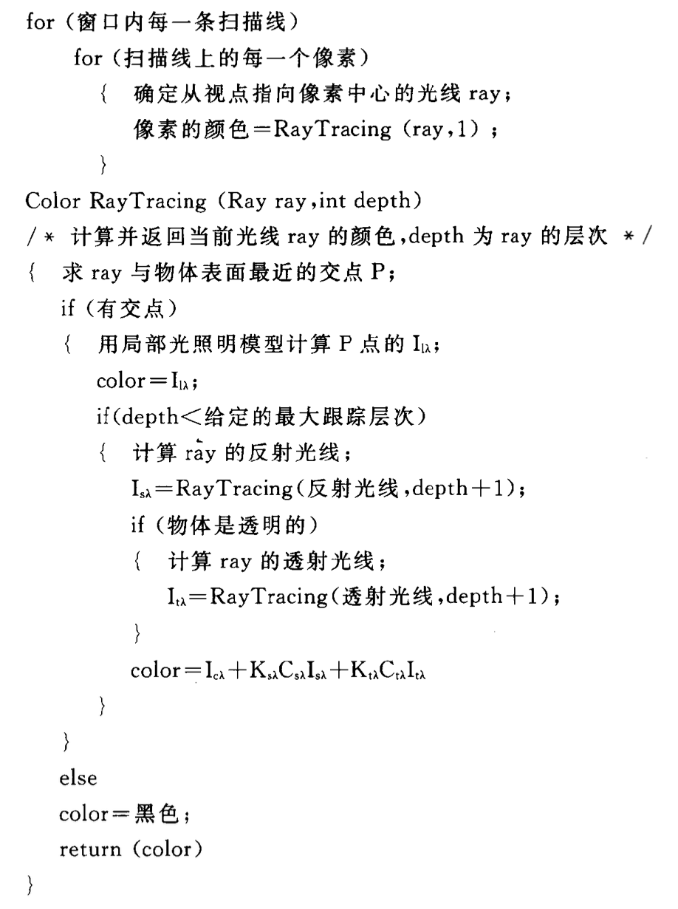
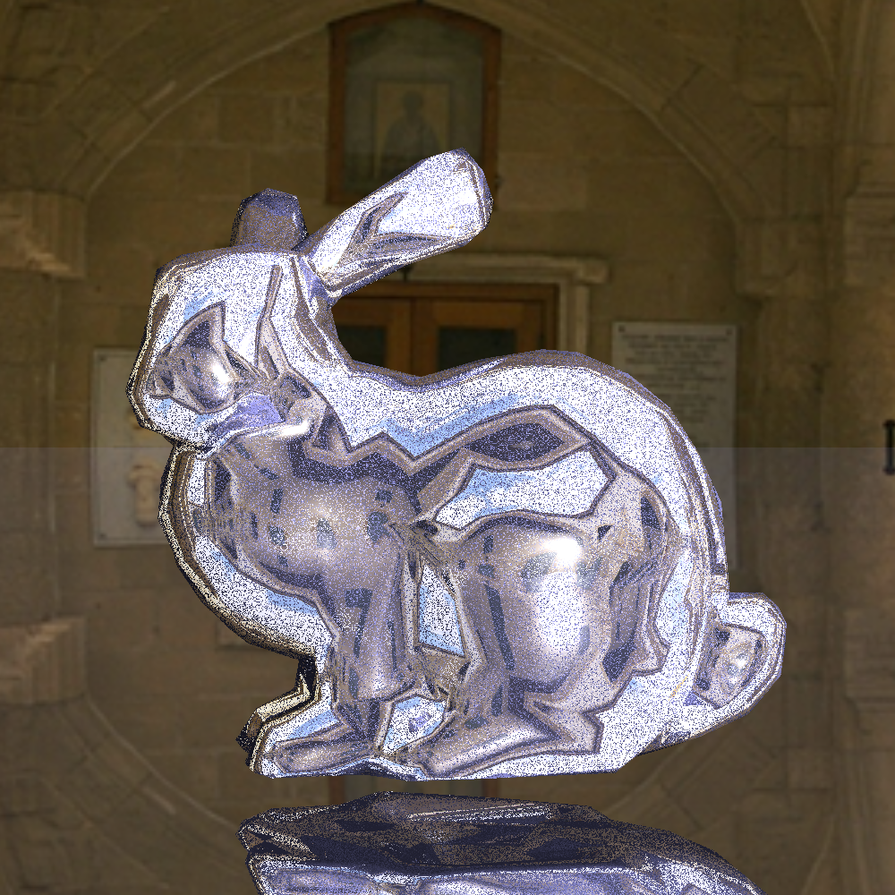
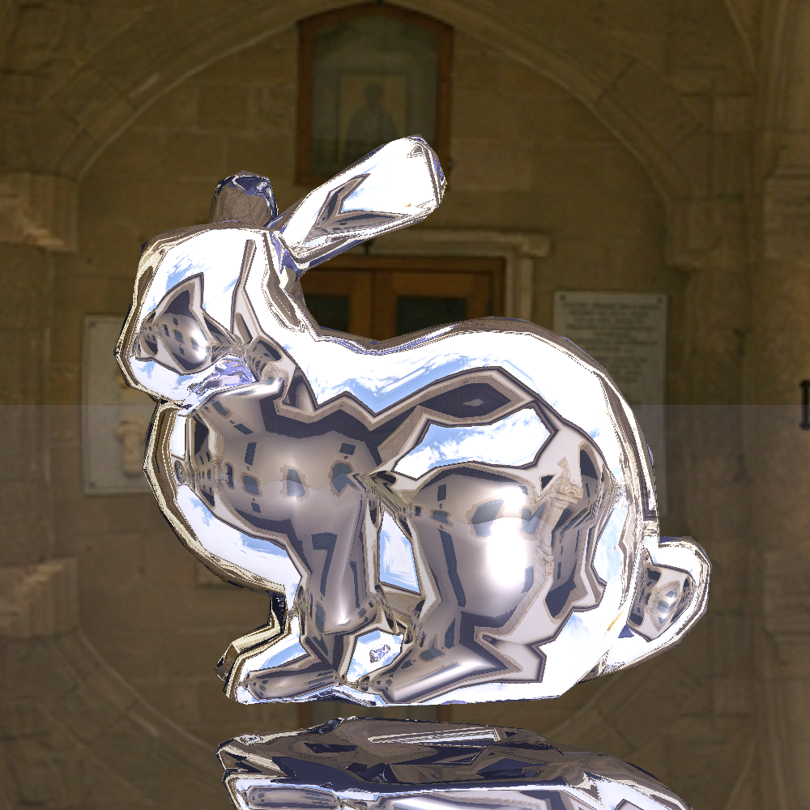
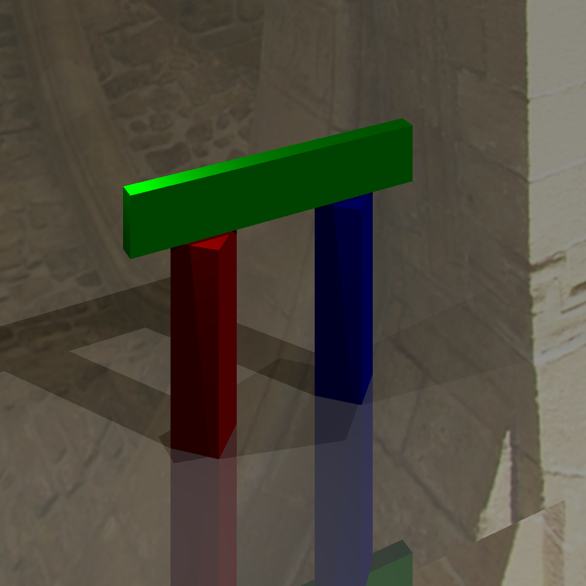
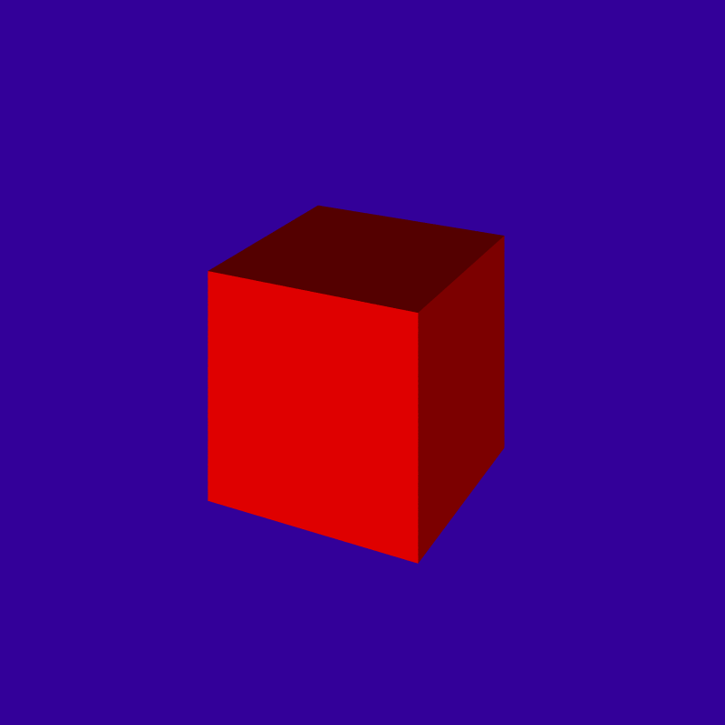
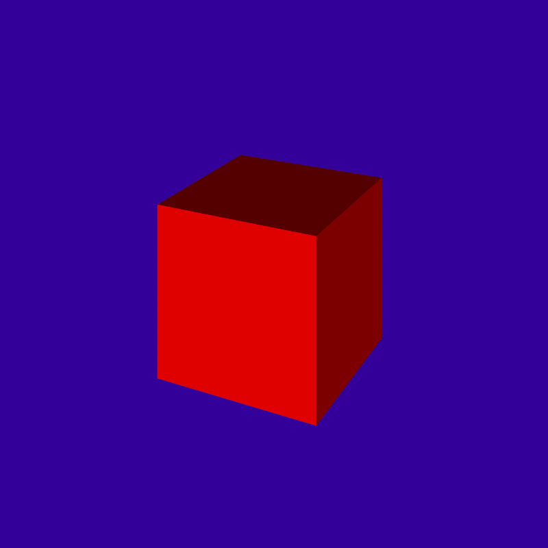
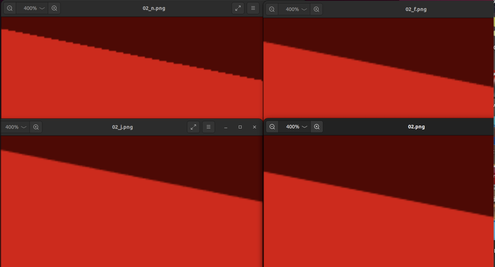

# <center> 图形学PJ2实验报告
### <center> 邹怡 21307130422 吴皓玥 21307110386
## 一.Phong着色模型
### 1.实验要求：
&emsp;&emsp;实现点光源和Phong光照反射模型。Phong着色模型由三部分组成：环境光（Ambient）、漫反射光（Diffuse）和镜面反射（Specular）。实验要求计算出这三个部分并返回累加的光照强度
### 2.实验原理：
#### i. 环境光（ambient）
环境光在Scene类中定义，可以通过调用`getAmbientLight() `函数获取。并通过公式$I_{ambient}=L_{ambient}*k_{diffuse}$计算光强
#### ii. 漫反射光（diffuse）
对于给定光线方向L和面法向量N，若光源在切平面以下，即(L·N<0)时漫反射为0，由公式
$$clamp(\mathbf{L},\mathbf{N}) = \begin{cases} 
      \mathbf{L}·\mathbf{N} & \text{if } \mathbf{L}·\mathbf{N} < 0 \\
      0 & \text{otherwise } 
\end{cases}$$
漫反射光强公式如下：
$I_{diffuse}=clamp(\mathbf{L}·\mathbf{N} )*L*k_{diffuse}$其中$k_{diffuse}$可以由`_diffuseColor`获得
#### iii. 镜面反射(specular)
假设入射光线的入射方向为 \( \mathbf{L} \)，表面的法向量为 \( \mathbf{N} \)，反射光线的方向为 \( \mathbf{R} \)，那么镜面反射的公式可以表示为：
\[ \mathbf{R} = \mathbf{L} - 2 (\mathbf{L} \cdot \mathbf{N}) \mathbf{N} \]
镜面反射项的公式为：
$$I_{specular}=clamp(L,R)^s*L*k_{specular}$$
其中光泽度s可以由`_shininess`得到，反射率k_specular 可以由`Material`类的`_specularColor`定义。
#### iv. 光照强度
将上面所计算的三个部分光强相加，其中漫反射和镜面反射需要累加所有光源的对应光强度，公式如下：
$$ I=I_{ambient}+\sum_{i \in {lights}}(I_{diffuse,i}+I_{specular,i})$$
在shade函数中进行遍历累加并返回累加值即可
### 3.代码分析
#### i. Light.cpp
`getIllumination`对在空间中的一个点修改以下三个值：
(a)tolight：从场景中一个点指向光源的方向矢量（归一化后的）。
(b)intensity：此时的照明强度（RGB）。
(c)distToLight：场景点与光源之间的距离。
点光源在距离为d的场景点$x_{surf}$处的光强，通过下面公式计算：
$$L(x_{surf})=\frac{I}{αd^2}$$，其中I为光源光强，α为衰减因子，可由`_falloff`得到，d为距离
```
    void PointLight::getIllumination(const Vector3f &p, 
                                 Vector3f &tolight, 
                                 Vector3f &intensity, 
                                 float &distToLight) const
    {
        // TODO Implement point light source
        // tolight, intensity, distToLight are outputs
        tolight =  (_position - p).normalized();
        distToLight = (_position - p).abs();
        intensity = _color/(_falloff*distToLight*distToLight);
    }
```

#### ii.Material.cpp
编写`shade`函数，用于计算漫反射光强和镜面反射光强
- 对于给定的光照`ray`和击中点`hit`,根据实验原理中的公式，获取击中点的法向量和光线的方向向量参与计算
- 分别计算出漫反射和镜面反射的clamp和光强I，并返回二者相加的和（返回一个三维向量分别代表RGB对应参数）
```
Vector3f Material::shade(const Ray &ray,
    const Hit &hit,
    const Vector3f &dirToLight,
    const Vector3f &lightIntensity)
{
    
    float clamp_d;
    clamp_d = Vector3f::dot(hit.getNormal(),dirToLight);
    clamp_d = clamp_d>0? clamp_d:0;
    Vector3f I_diffuse(0,0,0);
    I_diffuse = clamp_d*lightIntensity*_diffuseColor;
    
    float clamp_s;
    Vector3f R = 2*(Vector3f::dot(-ray.getDirection().normalized(),hit.getNormal().normalized()))*hit.getNormal()+ray.getDirection();
    clamp_s = Vector3f::dot(dirToLight,R.normalized());
    clamp_s = clamp_s>0?clamp_s:0;
    Vector3f I_specular(0,0,0);
    I_specular = std::pow(clamp_s,_shininess)*_specularColor*lightIntensity;
    return I_diffuse+I_specular;
}
```

#### iii. Renderer.cpp
实现traceRay函数，用于跟踪光线并计算场景中的光照效果。
-  函数接收一个光线`r`，光线的最小参数`tmin`，光线的最大反射次数`bounces`，以及一个`Hit`对象`h`和当前的递归深度`depth`。函数返回一个`Vector3f`类型的颜色值。
- 初始化颜色为黑色，`intersect`函数判断光线是否与场景中的物体相交，并寻找最近交点，用t参数化，并返回true，该函数会在后续part进行子类重写。
- 若与物体有交点，则使用`p = r.pointAtParameter(h.getT())`计算光线与物体相交点的位置。
- 遍历场景中的每一个光源，并通过`_scene.getLight(i)->getIllumination(p, tolight, intensity, distToLight);`获取光源在p点的强度信息，计算漫反射和镜面反射之和并将其叠加到`phong`中。
- 获取环境光，将其叠加到`phong`中并返回
- 如果光线没有与场景中的物体相交，则返回背景颜色。
```
Vector3f
Renderer::traceRay(const Ray &r,
    float tmin,
    int bounces,
    Hit &h,
    int depth) const
{
    Vector3f phong(0,0,0);

    if (_scene.getGroup()->intersect(r, tmin, h)) {//如果当前光线与物体相交
        Vector3f p = r.pointAtParameter(h.getT()); //获取击中的坐标；
        for(int i=0;i<_scene.getNumLights();i++)
        {
            Vector3f tolight,intensity;
            float distToLight;
            _scene.getLight(i)->getIllumination(p, tolight, intensity, distToLight);
            phong += h.getMaterial()->shade(r,h,tolight,intensity);
        }
        phong += _scene.getAmbientLight()*h.getMaterial()->getDiffuseColor();
        return phong;
    } else {
        return  _scene.getBackgroundColor(r.getDirection());
    };
}
```


## 二.光线投射
### 1. 实验要求
实现Object3D类中的不同子类，并实现`Plane`,`Triangle`,`Transform`中的`intersect()`函数。
### 2.实验原理&代码分析
#### i.intersect函数功能
在`traceRay()`函数中会对物体进行`intersect`判断光线是否与物体相交，并沿着光线寻找最近的交点进行更新。在寻找最近交点时，如果发现光线参数t>tmin并且t<h.getT()就说明新的交点比之前的进，需要更新Hit对象
#### ii. Plane
平面方程定义为P·N=dist，dist是相对原点的偏移量，n为法线，P为平面上的一点。光线方程的定义为 P=o+td，其中 o 是光源，可以由 `ray` 类的 `getOrigin` 函数得到，d 是光线的方向，由 `getDirection`函数得到，t 为我们需要求得的光线参数。将光线方程与平面方程联立，得到$dist= \mathbf{o}· \mathbf{N} + t* \mathbf{d}· \mathbf{N}$,可得$t=\frac{ dist-\mathbf{o}· \mathbf{N} }{ \mathbf{d}· \mathbf{N}}$
- 在Plane类中添加_normal和_d,分别代表平面的法向量和相对原点的偏移量，并进行初始化
- 先判断平面与光线是否相交，通过判断平面的法向量与光线方向向量的点积是否为0，若为0则说明二者垂直，不可能有交点
- 如果相交则计算光线参数t，并根据t的大小判断是否为最近的交点，如果是，则更新对应的光线参数、材料和法向量并返回true
```
bool Plane::intersect(const Ray &r, float tmin, Hit &h) const
{
    const Vector3f &rayOrigin = r.getOrigin(); //光线起始
    const Vector3f &dir = r.getDirection();//方向
    if(std::fabs(Vector3f::dot(_normal,dir))<1e-6)//光线方向与平面平行
        return false;

    float t;//交点参数
    t = (_d-Vector3f::dot(rayOrigin,_normal))/Vector3f::dot(_normal,dir);
    if(t < h.getT() && t > tmin) //在有效范围内（相交），则更新并返回相交
    { 
        h.set(t,this->material,_normal.normalized());//更新交点的材料，法向量
        return true;
    }
    return false;
}
```
#### iii.Triangle
利用射线与三角形相交的Möller-Trumbore 算法来判断光线是否与三角形相交。射线的参数方程为P=O + Dt，其中O是射线的起点，D是射线的方向。对于三角形中任意一点P，有
，其中0≤u，v≤1。联立方程有
 
 
 
 为了方便计算，可以转换成矩阵计算
 
 如果t ，u ，v 满足下面条件，那么射线就与三角形相交。
- 条件1：求得的t 必须是一个大于0 的数。
- 条件2：求得的u 和v 必须是一非负的数且值小于等于1。
- 条件3：求得的v + u 必须是一个小于等于1 的数。

根据上面的原理，可得代码思路：
- 检查光线方向与三角形法向量是否平行，如果平行则说明不相交，直接返回false。
- 构建一个3x3矩阵，用来进行射线与三角形的相交计算。根据上面原理进行矩阵逆运算，并分别得到t，u，v并对值进行判断，是否满足上面的条件，如果满足，说明找到更近的交点，更新相关参数并返回true
```
bool Triangle::intersect(const Ray &r, float tmin, Hit &h) const 
{
    const Vector3f &rayOrigin = r.getOrigin(); //光线起始
    const Vector3f &dir = r.getDirection();//方向
    Vector3f T_normal = _normals[0].normalized();
    if(std::fabs(Vector3f::dot(T_normal,dir))<1e-6)
        return false;
    
    float t,u,v;
    Matrix3f M(-dir, _v[1]-_v[0], _v[2]-_v[0]);
    Vector3f T = M.inverse()*(rayOrigin-_v[0]);
    t = T.x();
    u = T.y();
    v = T.z();
    if(t>tmin && t<h.getT() && u>=0.0 && v>=0.0 && u+v<=1.0)
    {
        Vector3f P_normal = _normals[0]*(1-u-v)+_normals[1]*u+_normals[2]*v;
        h.set(t,this->material,P_normal.normalized());
        return true;
    }

    return false;
}
```
#### iv. Transform
Transform类是从Object3D派生出来的类。变换类存储一个指向子类对象的指针，和一个4x4的变换矩阵M。变换矩阵M的作用是将子类对象从局部对象坐标移动到世界坐标。通过将光线从世界坐标变换到局部对象坐标，从而减小计算量。通过M.inverse()进行变换。
对于光源坐标可以通过M.inverse()进行变换，但是由于方向向量不包含位置信息，因此其齐次坐标表示为 (x, y, z, 0)，其中的最后一位为0表示该向量不包含平移信息。在进行变换时，如果直接使用齐次坐标变换矩阵乘以方向向量的齐次坐标向量，可能会导致结果中包含了非零的平移分量。故需要通过选择方向向量在世界坐标系中除了源坐标的另一个点进行变换。再将转换后的点相减得到转换后的方向向量<strong>（但是需要注意是终点坐标减源坐标，否则会显示不出图像）</strong>
- 在Transform类中添加_m作为转置矩阵
- 计算完变换的光线后，直接调用已有的intersect函数进行判断，并将法向量还原回世界坐标系
```
bool Transform::intersect(const Ray &r, float tmin, Hit &h) const
{
    const Vector3f &rayOrigin = r.getOrigin(); //光线起始
    Vector4f rayOrigin_tran,rayEnd_tran;
    rayOrigin_tran = _m.inverse()*Vector4f(rayOrigin,1);
    rayEnd_tran = _m.inverse()*Vector4f(r.pointAtParameter(1),1);
    Vector3f dir_tran = (rayEnd_tran-rayOrigin_tran).xyz();
    Ray ray_tran(rayOrigin_tran.xyz(),dir_tran);
    if(_object->intersect(ray_tran,tmin,h))
    {
        h.normal = ((_m.inverse()).transposed()*Vector4f(h.normal,1)).xyz().normalized();
        return true;
    }
    return false;
}
```

## 三、光线追踪与阴影投射
### 1.实验要求：
（1）递归调用traceRay在镜面材料之间进行光线追踪。
（2）在每次shade()函数调用之前,计算光线与物体表面交点的颜色之前计算投射阴影。

### 2.实验原理：
#### i.整体光照明模型
为增加图形的逼真度，需要考虑物体之间的相互影响，包括漫反射、镜面反射和透射等现象。其中，漫反射表现为颜色在物体表面扩散，可以通过辐射度方法来模拟；镜面反射和透射使得我们可以看到光洁物体表面反射或折射其他物体的影像，这种整体光照明模型很好地模拟了这些现象。这个模型将物体表面朝向视点方向辐射的亮度分为三部分：
(1) 光源直接照射引起的反射光亮度，记为$I_{l\lambda}$，使用局部光照明模型计算；
(2) 来自视点方向的镜面反射方向R的其他物体反射或折射来的光亮度，记为 $I_{s\lambda}$；
(3) 来自视点方向的透射方向T的其他物体反射或折射来的光亮度，记为 $I_{t\lambda}$。
$$ I_{\lambda} = I_{l\lambda} + K_sC_{s\lambda}I_{s\lambda}
= K_aC_{d\lambda}I_{a\lambda} + \sum_{i=1}^{m}S_if (d_i)I_{p_i\lambda}[K_dC_{d\lambda}(L_i * N) + K_sC_{s\lambda}(H_t*N)^n] + K_sC_{s\lambda}I_{s\lambda} + K_tC_{t\lambda}I_{t\lambda}
$$

#### ii. 光线跟踪算法的基本原理
光线追踪可以分为一下几个步骤：
（1）光线追踪从观察者出发，沿着每个像素的方向发射一条光线。
（2）光线与场景中的物体相交，找到离观察者最近的交点。
（3）确定了光线与物体的交点，计算该点的光照属性。
（4）光线可能会被物体表面反射、折射或发生散射，从而生成新的光线。在这种情况下，可以通过递归调用光线追踪算法来跟踪这些新的光线。
（5）最后，通过将每个像素的光线与物体相交的结果合成起来，形成最终的图像。
自然界中，光线在物体间的反射和折射可以无止境地进行下去，但在算法中要给出递归的终止条件，可以采用以下几种方式：
（1）光线不与场景中的任何物体相交
（2）被跟踪的光线达到了给定的层次
（3）被跟踪光线对像素亮度的贡献小于某个阈值
书上给出的伪代码如下：



#### iii. 产生阴影
加人阴影效果的光照明模型通常会在计算光照时考虑阴影的影响。这样可以使得场景中的物体在光线遮挡的区域内不再受到光源的直接照射，从而呈现出更真实的光影效果。
典型的光照明模型在计算物体表面上某点的亮度时，会检查该点是否位于光源的阴影之中。如果是，则该点的亮度不再受到光源直接照射。因此，加入阴影效果的光照明模型为：
$$ I_{\lambda}
= K_aC_{d\lambda}I_{a\lambda} + \sum_{i=1}^{m}S_if (d_i)I_{p_i\lambda}[K_dC_{d\lambda}(L_i * N) + K_sC_{s\lambda}(H_t*N)^n]
$$
其中S_i = 0，如果P处于第i个光源阴影中。

### 3.代码分析
#### i.光线跟踪
* 反射光线方向的计算式为$R = 2*N(L*N)-L$，通过`h.getNormal().normalized()`和`-r.getDirection().normalized()`获得法线N和入射光线L，带入计算式中获得反射光线。
* 得到新的反射光线后调用`traceRay`进行递归计算，并将深度`depth+1`和递归阈值传递给函数，以便控制反射次数。

**代码如下**
```c++
Vector3f I_indirect(0,0,0);
if(depth<bounces){
    // 计算ray的反射光线 R = 2*N(L*N)-L(单位矢量)
    Vector3f N = h.getNormal().normalized();
    Vector3f L = -r.getDirection().normalized();
    Vector3f Ray_dir = (2 * N * (Vector3f::dot(L, N)) - L).normalized();
    Ray newray(p, Ray_dir);
    Hit newh;
    //Camera* cam = _scene.getCamera();
    //I_indirect = traceRay(newray, cam->getTMin(), bounces, newh, depth+1);
    I_indirect = traceRay(newray, 1e-4, bounces, newh, depth+1);
}
phong += h.getMaterial()->getSpecularColor() * I_indirect;
```

**问题与结果比较**
（1）`I_indirect = traceRay(newray, tmin, bounces, newh, depth+1);`一开始模仿traceRay调用的地方将`tmin`设置为`cam->getTMin()`，渲染结果如下


检查`cam->getTMin()`的值后发现输入是0，可能产生了过度递归调用，于是使用多个值进行尝试：
<div style="overflow: hidden;">
    <div style="float: left; width: 33.33%;">
        
    </div>
    <div style="float: left; width: 33.33%;">
        
    </div>
    <div style="float: left; width: 33.33%;">
        
    </div>
</div>

上图从左到右为`tmin`取1e-2、1e-3、1e-4的渲染表现，很难看出区别，并且值越小，生成时间越久。

#### ii.阴影投射
* 首先建立了从光源到物体表面某一点的光线，判断这条光线与物体是否有交点。
* 如果没有遮挡光线的物体，就计算光照，计算得到的颜色值加到`phong`变量上。

**代码如下**
```c++
//阴影
Ray r_temp(p, tolight);
Hit h_o;
// 判断是否与物体有交点
if(!_args.shadows||!(_scene.getGroup()->intersect(r_temp, 1e-4, h_o))){ 
    phong += h.getMaterial()->shade(r,h,tolight,intensity);
}
```
**问题与结果比较**
`(_scene.getGroup()->intersect(r_temp, 1e-4, h_o))`
一开始在`1e-4`位置直接使用了`traceRay`中的参数`tmin`，渲染结果如下：


在ppt中也提示到“需要将射线原点稍微远离表面交点，例如设置tmin为0.0001，否则射线和起始点相交，使程序始终认为交点在阴影中”，但在第一轮光线追踪的时候`tmin`默认为0，所以产生了错误，这里直接把值定为0.0001，可以输出正确的结果。


## 四、抗锯齿的问题
### 1.实验要求
在Renderer::Render()函数实现抖动采样和上采样高斯滤波。

### 2.实验原理
#### i. 抖动采样
抖动采样在每个像素内部按某种方式随机选择多个采样点，进行多次光线追踪，并对追踪到的颜色进行平均，得到该像素的最终颜色，以此减少锯齿状边缘，使图像看起来更加平滑和真实。
伪代码如下：
```
for each pixel (i, j) do 
    c=0
    for p = 0 to n − 1 do
        for q = 0 to n − 1 do
        c = c + ray-color(i + (p + ξ)/n, j + (q + ξ)/n)
    c_{ij} = c/n^2
```
#### ii. 高斯滤波
高斯滤波是一种常用的图像处理技术，用于模糊图像或降低图像的噪声。它基于高斯函数来计算图像中每个像素的权重，然后通过对像素及其周围像素的加权平均来实现滤波效果。高斯滤波通常用于平滑图像、去除噪声、边缘检测等图像处理任务中。
本次作业中是离散的像素而且只考虑相邻的像素，所以把高斯滤波器简化为下面的矩阵：
$$1/16\begin{bmatrix}
1 & 2 & 1 \\
2 & 4 & 2 \\
1 & 2 & 1 \\
\end{bmatrix}
$$
### 3.代码实现
#### i. 抖动采样
根据书上的伪代码，对于每一个像素点，先把像素点分成4*4个小块，每个小块中随机取一点调用`traceRay`函数计算，然后把16个点的平均值作为该像素的采样值。
**代码如下**
```c++
void
Renderer::Render()
{
    int w = _args.width;
    int h = _args.height;
    Camera* cam = _scene.getCamera();
    float x_step = 2.0f / (w - 1.0f);
    float y_step = 2.0f / (h - 1.0f);
    for (int y = 0; y < h; ++y) {
        float ndcy = 2 * (y / (h - 1.0f)) - 1.0f;
        for (int x = 0; x < w; ++x) {
            float ndcx = 2 * (x / (w - 1.0f)) - 1.0f;
            Vector3f color(0,0,0);
            Hit h;
            if(_args.jitter){
                for(int p = 0; p<4; p++){
                    for(int q = 0; q<4; q++){
                        float random_x = static_cast<double>(rand()) / RAND_MAX; // 生成0到1的随机数
                        float random_y = static_cast<double>(rand()) / RAND_MAX;
                        float x_rand = ndcx + (p+random_x)/4.0 * x_step;
                        float y_rand = ndcy + (q+random_y)/4.0 * y_step;
                        Ray r = cam->generateRay(Vector2f(x_rand, y_rand));
                        Hit newh;
                        Vector3f color_temp = traceRay(r, cam->getTMin(), _args.bounces, newh, 0);
                        color+= color_temp;
                    }
                }
                color = color/16.0;
            }else{
                Ray r = cam->generateRay(Vector2f(ndcx, ndcy)); // 根据像素位置生成光线
                color = traceRay(r, cam->getTMin(), _args.bounces, h, 0);
            }
            
            image.setPixel(x, y, color);
            nimage.setPixel(x, y, (h.getNormal() + 1.0f) / 2.0f);
            float range = (_args.depth_max - _args.depth_min);
            if (range) {
                dimage.setPixel(x, y, Vector3f((h.t - _args.depth_min) / range));
            }
        }
    }
    // save the files 
    if (_args.output_file.size()) {
        image.savePNG(_args.output_file);
    }
    if (_args.depth_file.size()) {
        dimage.savePNG(_args.depth_file);
    }
    if (_args.normals_file.size()) {
        nimage.savePNG(_args.normals_file);
    }   
}
```
#### ii. 高斯滤波
* 首先进行倍数为3的上采样，在初始化image时将长宽变为原来的3倍。
* 然后对每个像素点调用`traceRay`函数进行采样。
* 如果`_args.filter == True`时，使用高斯滤波器进行下采样，每9个像素点为一组，进行加权求和作为中间像素的值，保存在新的image中。
  
**代码如下**

(1)上采样
```c++
Matrix3f Gaussian_Filter(1.0/16,2.0/16,1.0/16,2.0/16,4.0/16,2.0/16,1.0/16,2.0/16,1.0/16);// 高斯滤波
if(_args.filter){ // 上采样
    w = 3 * w;
    h = 3 * h;
}
```
（2）使用高斯滤波器进行下采样
```c++
if(_args.filter){
    int w_f = w/3;
    int h_f = h/3;
    Image f_image(w_f, h_f);
    Image f_nimage(w_f, h_f);
    Image f_dimage(w_f, h_f);
    for (int y = 0; y < h_f; ++y) {
        //float ndcy = 2 * (y / (h_f - 1.0f)) - 1.0f;
        for (int x = 0; x < w_f; ++x) {
            //float ndcx = 2 * (x / (w_f - 1.0f)) - 1.0f;
            //尝试都进行高斯滤波
            Vector3f color(0,0,0);
            Vector3f n(0,0,0);
            Vector3f d(0,0,0);
            for(int i = 0; i < 3; i++){
                for(int j = 0; j < 3; j++){
                    int temp_x = 3*x + i;
                    int temp_y = 3*y + j;
                    color += Gaussian_Filter(i, j)*image.getPixel(temp_x, temp_y);
                    n += Gaussian_Filter(i, j)*nimage.getPixel(temp_x, temp_y);
                    d += Gaussian_Filter(i, j)*dimage.getPixel(temp_x, temp_y);
                }   
            }
            f_image.setPixel(x, y, color);
            f_nimage.setPixel(x, y, n);
            f_dimage.setPixel(x, y, d);
        }
    }
    // save the files 
    if (_args.output_file.size()) {
        f_image.savePNG(_args.output_file);
    }
    if (_args.depth_file.size()) {
        f_dimage.savePNG(_args.depth_file);
    }
    if (_args.normals_file.size()) {
        f_nimage.savePNG(_args.normals_file);
    }
}else{
    //保存原来的image
}
```

**问题与结果分析**
在抖动采样中，`Vector3f color_temp = traceRay(r, cam->getTMin(), _args.bounces, newh, 0);`这步使用了原来的h，每次新的光线相交都会更新`h`的相交信息，导致了部分像素颜色的不正确。

新建一个Hit对象保存交点，可以得到正确的结果。


## 五.实验结果
### Part1
<div></div>

### Part2
<div></div>
<div></div>
<div></div>
<div></div>
<div></div>

### Part3


### Part4
* 没有任何处理抖动采样


* 抖动采样


* 高斯滤波


* 抖动采样+高斯滤波


**细节对比**

