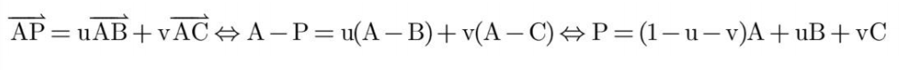
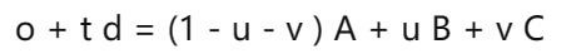
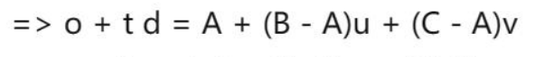
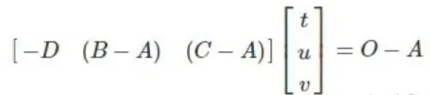
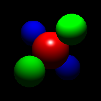
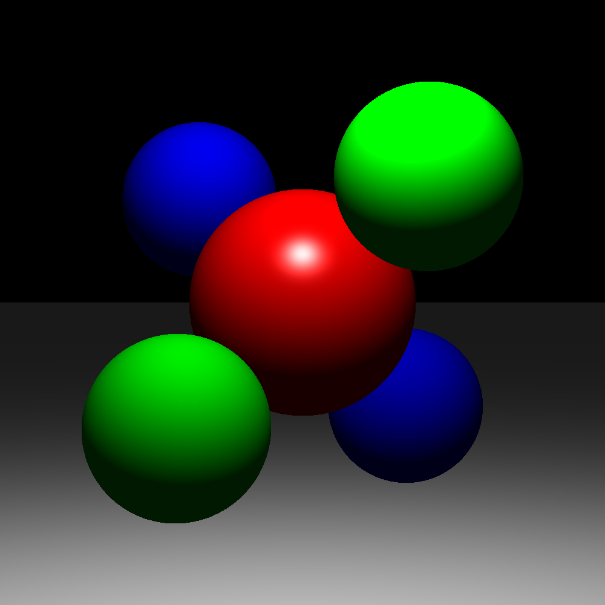
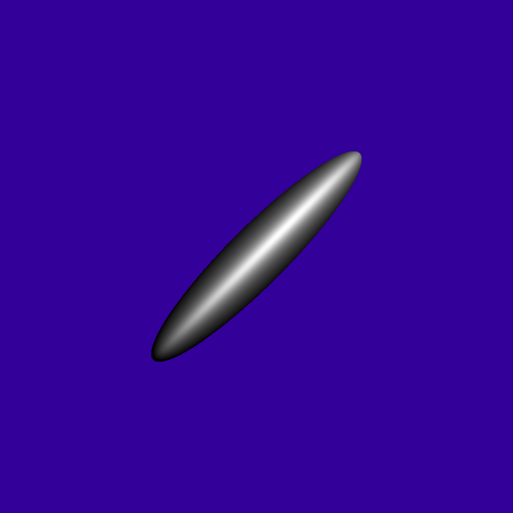
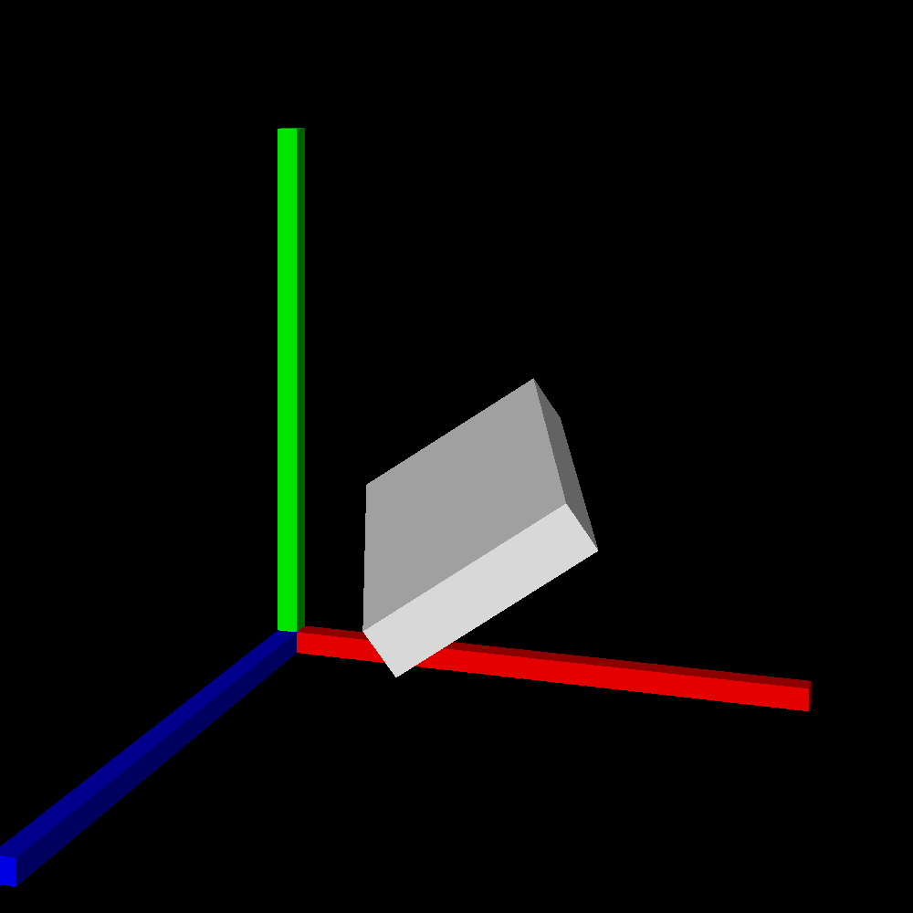
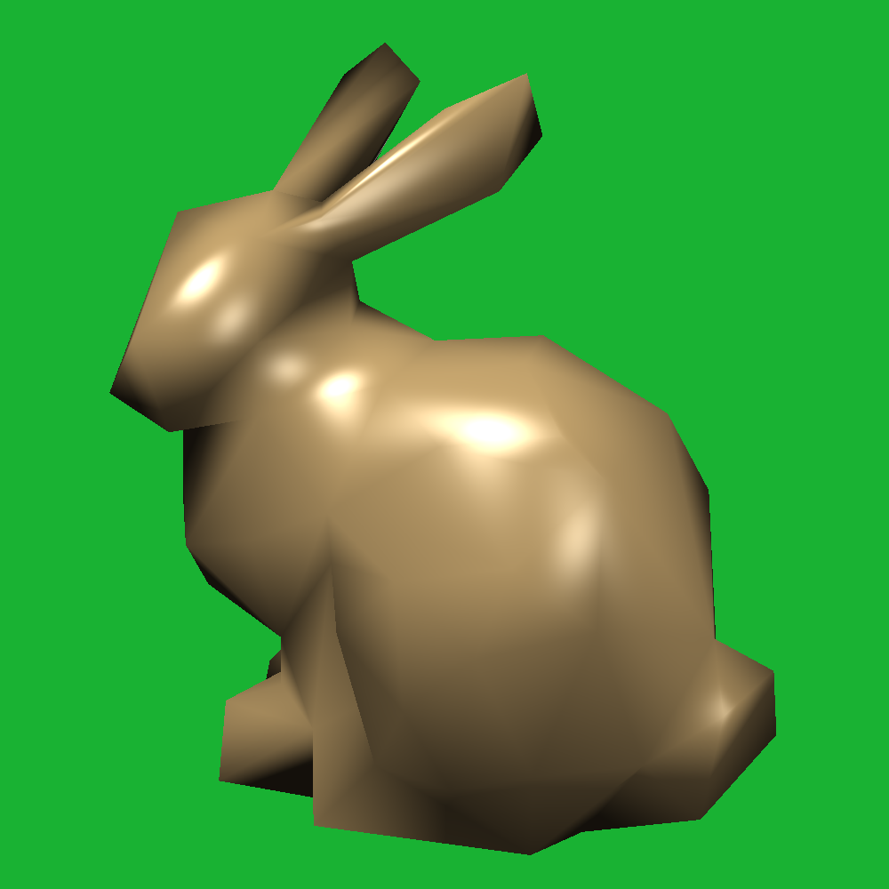

# <center> 图形学PJ2实验报告
### <center> 邹怡 21307130422 吴皓玥 21307110386
## 一.Phong着色模型
### 1.实验要求：
&emsp;&emsp;实现点光源和Phong光照反射模型。Phong着色模型由三部分组成：环境光（Ambient）、漫反射光（Diffuse）和镜面反射（Specular）。实验要求计算出这三个部分并返回累加的光照强度
### 2.实验原理：
#### i. 环境光（ambient）
环境光在Scene类中定义，可以通过调用`getAmbientLight() `函数获取。并通过公式$I_{ambient}=L_{ambient}*k_{diffuse}$计算光强
#### ii. 漫反射光（diffuse）
对于给定光线方向L和面法向量N，若光源在切平面以下，即(L·N<0)时漫反射为0，由公式
$clamp(\mathbf{L},\mathbf{N}) = \begin{cases} 
      \mathbf{L}·\mathbf{N} & \text{if } \mathbf{L}·\mathbf{N} < 0 \\
      0 & \text{otherwise } 
\end{cases}$
漫反射光强公式如下：
$I_{diffuse}=clamp(\mathbf{L}·\mathbf{N} )*L*k_{diffuse}$其中$k_{diffuse}$可以由`_diffuseColor`获得
#### iii. 镜面反射(specular)
假设入射光线的入射方向为 \( \mathbf{L} \)，表面的法向量为 \( \mathbf{N} \)，反射光线的方向为 \( \mathbf{R} \)，那么镜面反射的公式可以表示为：
\[ \mathbf{R} = \mathbf{L} - 2 (\mathbf{L} \cdot \mathbf{N}) \mathbf{N} \]
镜面反射项的公式为：
$I_{specular}=clamp(L,R)^s*L*k_{specular}$ 
其中光泽度s可以由`_shininess`得到，反射率k_specular 可以由`Material`类的`_specularColor`定义。
#### iv.光照强度
将上面所计算的三个部分光强相加，其中漫反射和镜面反射需要累加所有光源的对应光强度，公式如下：
$ I=I_{ambient}+\sum_{i \in {lights}}(I_{diffuse,i}+I_{specular,i})$
在shade函数中进行遍历累加并返回累加值即可
### 3.代码分析
#### i. Light.cpp
`getIllumination`对在空间中的一个点修改以下三个值：
(a)tolight：从场景中一个点指向光源的方向矢量（归一化后的）。
(b)intensity：此时的照明强度（RGB）。
(c)distToLight：场景点与光源之间的距离。
点光源在距离为d的场景点$x_{surf}$处的光强，通过下面公式计算：
$L(x_{surf})=\frac{I}{αd^2}$，其中I为光源光强，α为衰减因子，可由`_falloff`得到，d为距离
```
    void PointLight::getIllumination(const Vector3f &p, 
                                 Vector3f &tolight, 
                                 Vector3f &intensity, 
                                 float &distToLight) const
    {
        // TODO Implement point light source
        // tolight, intensity, distToLight are outputs
        tolight =  (_position - p).normalized();
        distToLight = (_position - p).abs();
        intensity = _color/(_falloff*distToLight*distToLight);
    }
```
#### ii.Material.cpp
编写`shade`函数，用于计算漫反射光强和镜面反射光强
- 对于给定的光照`ray`和击中点`hit`,根据实验原理中的公式，获取击中点的法向量和光线的方向向量参与计算
- 分别计算出漫反射和镜面反射的clamp和光强I，并返回二者相加的和（返回一个三维向量分别代表RGB对应参数）
```
Vector3f Material::shade(const Ray &ray,
    const Hit &hit,
    const Vector3f &dirToLight,
    const Vector3f &lightIntensity)
{
    
    float clamp_d;
    clamp_d = Vector3f::dot(hit.getNormal(),dirToLight);
    clamp_d = clamp_d>0? clamp_d:0;
    Vector3f I_diffuse(0,0,0);
    I_diffuse = clamp_d*lightIntensity*_diffuseColor;
    
    float clamp_s;
    Vector3f R = 2*(Vector3f::dot(-ray.getDirection().normalized(),hit.getNormal().normalized()))*hit.getNormal()+ray.getDirection();
    clamp_s = Vector3f::dot(dirToLight,R.normalized());
    clamp_s = clamp_s>0?clamp_s:0;
    Vector3f I_specular(0,0,0);
    I_specular = std::pow(clamp_s,_shininess)*_specularColor*lightIntensity;
    return I_diffuse+I_specular;
}
```
#### iii. Renderer.cpp
实现traceRay函数，用于跟踪光线并计算场景中的光照效果。
-  函数接收一个光线`r`，光线的最小参数`tmin`，光线的最大反射次数`bounces`，以及一个`Hit`对象`h`和当前的递归深度`depth`。函数返回一个`Vector3f`类型的颜色值。
- 初始化颜色为黑色，`intersect`函数判断光线是否与场景中的物体相交，并寻找最近交点，用t参数化，并返回true，该函数会在后续part进行子类重写。
- 若与物体有交点，则使用`p = r.pointAtParameter(h.getT())`计算光线与物体相交点的位置。
- 遍历场景中的每一个光源，并通过`_scene.getLight(i)->getIllumination(p, tolight, intensity, distToLight);`获取光源在p点的强度信息，计算漫反射和镜面反射之和并将其叠加到`phong`中。
- 获取环境光，将其叠加到`phong`中并返回
- 如果光线没有与场景中的物体相交，则返回背景颜色。
```
Vector3f
Renderer::traceRay(const Ray &r,
    float tmin,
    int bounces,
    Hit &h,
    int depth) const
{
    Vector3f phong(0,0,0);

    if (_scene.getGroup()->intersect(r, tmin, h)) {//如果当前光线与物体相交
        Vector3f p = r.pointAtParameter(h.getT()); //获取击中的坐标；
        for(int i=0;i<_scene.getNumLights();i++)
        {
            Vector3f tolight,intensity;
            float distToLight;
            _scene.getLight(i)->getIllumination(p, tolight, intensity, distToLight);
            phong += h.getMaterial()->shade(r,h,tolight,intensity);
        }
        phong += _scene.getAmbientLight()*h.getMaterial()->getDiffuseColor();
        return phong;
    } else {
        return  _scene.getBackgroundColor(r.getDirection());
    };
}
```
---
## 二.光线投射
### 1. 实验要求
实现Object3D类中的不同子类，并实现`Plane`,`Triangle`,`Transform`中的`intersect()`函数。
### 2.实验原理&代码分析
#### i.intersect函数功能
在`traceRay()`函数中会对物体进行`intersect`判断光线是否与物体相交，并沿着光线寻找最近的交点进行更新。在寻找最近交点时，如果发现光线参数t>tmin并且t<h.getT()就说明新的交点比之前的进，需要更新Hit对象
#### ii. Plane
平面方程定义为P·N=dist，dist是相对原点的偏移量，n为法线，P为平面上的一点。光线方程的定义为 P=o+td，其中 o 是光源，可以由 `ray` 类的 `getOrigin` 函数得到，d 是光线的方向，由 `getDirection`函数得到，t 为我们需要求得的光线参数。将光线方程与平面方程联立，得到$dist= \mathbf{o}· \mathbf{N} + t* \mathbf{d}· \mathbf{N}$,可得$t=\frac{ dist-\mathbf{o}· \mathbf{N} }{ \mathbf{d}· \mathbf{N}}$
- 在Plane类中添加_normal和_d,分别代表平面的法向量和相对原点的偏移量，并进行初始化
- 先判断平面与光线是否相交，通过判断平面的法向量与光线方向向量的点积是否为0，若为0则说明二者垂直，不可能有交点
- 如果相交则计算光线参数t，并根据t的大小判断是否为最近的交点，如果是，则更新对应的光线参数、材料和法向量并返回true
```
bool Plane::intersect(const Ray &r, float tmin, Hit &h) const
{
    const Vector3f &rayOrigin = r.getOrigin(); //光线起始
    const Vector3f &dir = r.getDirection();//方向
    if(std::fabs(Vector3f::dot(_normal,dir))<1e-6)//光线方向与平面平行
        return false;

    float t;//交点参数
    t = (_d-Vector3f::dot(rayOrigin,_normal))/Vector3f::dot(_normal,dir);
    if(t < h.getT() && t > tmin) //在有效范围内（相交），则更新并返回相交
    { 
        h.set(t,this->material,_normal.normalized());//更新交点的材料，法向量
        return true;
    }
    return false;
}
```
#### iii.Triangle
利用射线与三角形相交的Möller-Trumbore 算法来判断光线是否与三角形相交。射线的参数方程为P=O + Dt，其中O是射线的起点，D是射线的方向。对于三角形中任意一点P，有
，其中0≤u，v≤1。联立方程有
 
 
 
 为了方便计算，可以转换成矩阵计算
 
 如果t ，u ，v 满足下面条件，那么射线就与三角形相交。
- 条件1：求得的t 必须是一个大于0 的数。
- 条件2：求得的u 和v 必须是一非负的数且值小于等于1。
- 条件3：求得的v + u 必须是一个小于等于1 的数。

根据上面的原理，可得代码思路：
- 检查光线方向与三角形法向量是否平行，如果平行则说明不相交，直接返回false。
- 构建一个3x3矩阵，用来进行射线与三角形的相交计算。根据上面原理进行矩阵逆运算，并分别得到t，u，v并对值进行判断，是否满足上面的条件，如果满足，说明找到更近的交点，更新相关参数并返回true
```
bool Triangle::intersect(const Ray &r, float tmin, Hit &h) const 
{
    const Vector3f &rayOrigin = r.getOrigin(); //光线起始
    const Vector3f &dir = r.getDirection();//方向
    Vector3f T_normal = _normals[0].normalized();
    if(std::fabs(Vector3f::dot(T_normal,dir))<1e-6)
        return false;
    
    float t,u,v;
    Matrix3f M(-dir, _v[1]-_v[0], _v[2]-_v[0]);
    Vector3f T = M.inverse()*(rayOrigin-_v[0]);
    t = T.x();
    u = T.y();
    v = T.z();
    if(t>tmin && t<h.getT() && u>=0.0 && v>=0.0 && u+v<=1.0)
    {
        Vector3f P_normal = _normals[0]*(1-u-v)+_normals[1]*u+_normals[2]*v;
        h.set(t,this->material,P_normal.normalized());
        return true;
    }

    return false;
}
```
#### iv. Transform
Transform类是从Object3D派生出来的类。变换类存储一个指向子类对象的指针，和一个4x4的变换矩阵M。变换矩阵M的作用是将子类对象从局部对象坐标移动到世界坐标。通过将光线从世界坐标变换到局部对象坐标，从而减小计算量。通过M.inverse()进行变换。
对于光源坐标可以通过M.inverse()进行变换，但是由于方向向量不包含位置信息，因此其齐次坐标表示为 (x, y, z, 0)，其中的最后一位为0表示该向量不包含平移信息。在进行变换时，如果直接使用齐次坐标变换矩阵乘以方向向量的齐次坐标向量，可能会导致结果中包含了非零的平移分量。故需要通过选择方向向量在世界坐标系中除了源坐标的另一个点进行变换。再将转换后的点相减得到转换后的方向向量<strong>（但是需要注意是终点坐标减源坐标，否则会显示不出图像）</strong>
- 在Transform类中添加_m作为转置矩阵
- 计算完变换的光线后，直接调用已有的intersect函数进行判断，并将法向量还原回世界坐标系
```
bool Transform::intersect(const Ray &r, float tmin, Hit &h) const
{
    const Vector3f &rayOrigin = r.getOrigin(); //光线起始
    Vector4f rayOrigin_tran,rayEnd_tran;
    rayOrigin_tran = _m.inverse()*Vector4f(rayOrigin,1);
    rayEnd_tran = _m.inverse()*Vector4f(r.pointAtParameter(1),1);
    Vector3f dir_tran = (rayEnd_tran-rayOrigin_tran).xyz();
    Ray ray_tran(rayOrigin_tran.xyz(),dir_tran);
    if(_object->intersect(ray_tran,tmin,h))
    {
        h.normal = ((_m.inverse()).transposed()*Vector4f(h.normal,1)).xyz().normalized();
        return true;
    }
    return false;
}
```

## 三、
I_indirect = traceRay(newray, 1e-4, bounces, newh, depth+1);中1e-4取值尝试，值越小，生成时间越久
Vector3f L = -r.getDirection().normalized();要加负号
阴影问题07_p (_scene.getGroup()->intersect(r_temp, 1e-4, h_o))中1e-4设置为tmin的，但是在第一轮的时候值好像是0
## 五.实验结果
### Part1
<div></div>

### Part2
<div></div>
<div></div>
<div></div>
<div></div>
<div></div>